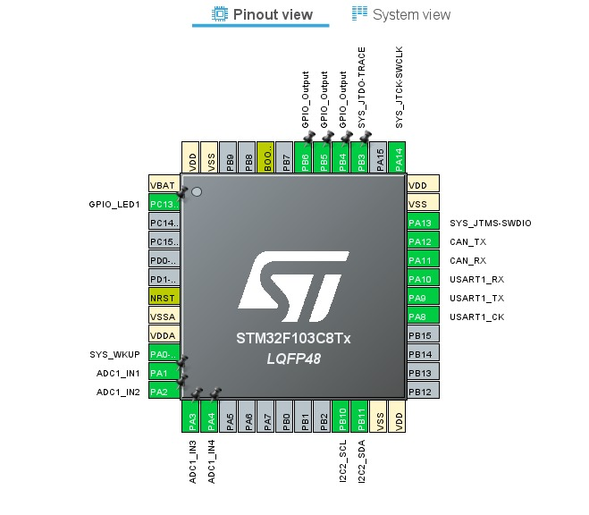

# Temperature Monitoring Module Project  
*Using STM32F103 MCU, Thermistors, CAN Bus, and UART Debugging*

## 📋 Project Overview

This project implements a dual-channel temperature monitoring module using thermistor sensors, STM32F103 microcontroller, and CAN bus for data communication. It supports:

- Real-time temperature sensing with thermistor sensors.
- Temperature calculation using the Steinhart–Hart Beta model.
- Communication of temperature data over CAN bus.
- Debugging and monitoring using UART.
- Robust error handling for sensor faults.

## 🛠️ Hardware Components

| Component               | Description                    |
|-------------------------|--------------------------------|
| STM32F103 Microcontroller | Core processing unit |
| 10kΩ NTC Thermistors    | Temperature sensors |
| CAN Transceiver | CAN Bus Communication |
| UART (USART1) | Debug Console |
| LEDs (PC13) | System Status Indication |
| Voltage Divider Circuit | Thermistor Interface |

## ⚙️ Software Features

### 1️⃣ Peripheral Initialization
- **ADC1** for thermistor analog voltage measurement (PA1 & PA2).
- **CAN1** configured at **250 kbps**, with auto-retransmission enabled.
- **USART1** configured at **115200 baud** for UART debug output.
- **GPIOC Pin 13** toggled as status LED.

### 2️⃣ Thermistor Temperature Calculation
- Based on **Beta Model Equation**:
  
  \[
  T(K) = \frac{1}{\frac{1}{T_0} + \frac{1}{B} \cdot \ln(\frac{R}{R_0})}
  \]
  
- Constants used:
  - **R₀** = 10kΩ (resistance @ 25°C)
  - **B** = 7500
  - **T₀** = 298.15K (25°C)
  - **Vcc** = 3.3V
  - **Series resistor (R)** = 10kΩ

- ADC voltage converted to resistance, then to temperature (°C).

### 3️⃣ Sensor Fault Handling
- **Open circuit detection** (ADC > 4000)
- **Short circuit detection** (ADC < 10)
- **Invalid resistance range** detection (R < 100Ω or > 100kΩ)
- Fallback default temperature = **25°C**
- Increment global `errorCount` on fault.

### 4️⃣ Temperature Data Processing
- Calculation of **Max**, **Min**, and **Average** temperatures.
- Real-time UART prints:
  - Raw ADC value
  - Voltage
  - Resistance
  - Computed Temperature
  - Fault status (if any)

### 5️⃣ CAN Bus Communication
- CAN message format (8 bytes):

| Byte | Data |
|------|------|
| 0-1 | Max Temperature (×10, int16_t) |
| 2-3 | Min Temperature (×10, int16_t) |
| 4-5 | Avg Temperature (×10, int16_t) |
| 6 | Number of sensors |
| 7 | Error count (clamped to 255) |

- Retry mechanism (up to 3 tries) for CAN TX failures.

### 6️⃣ Debug Output (UART + ITM)
- All messages sent to both **USART1** and **ITM Console**.

## 🖥️ Software Stack

- **STM32Cube HAL Library**
- **STM32CubeIDE**
- **C Language**

## 🔁 System Flow Diagram

+-------------------------+
| Initialize Peripherals |
+-------------------------+
|
v
+-------------------------+
| Read Thermistor ADCs |
+-------------------------+
|
v
+-------------------------+
| Calculate Temperatures |
+-------------------------+
|
v
+-------------------------+
| UART Debug Output |
+-------------------------+
|
v
+-------------------------+
| Send CAN Message |
+-------------------------+
|
v
+-------------------------+
| Toggle Status LED (PC13)|
+-------------------------+
|
v
|---- Delay 1 second ---->|
|
v
Repeat (While Loop)

## 🛡️ Error Handling Summary

| Fault Type | Detection Method | Action |
|------------|------------------|--------|
| Open Circuit | ADC > 4000 | Default 25°C, increment errorCount |
| Short Circuit | ADC < 10 | Default 25°C, increment errorCount |
| Invalid Resistance | R < 100Ω or R > 100kΩ | Default 25°C, increment errorCount |
| CAN TX Failure | TX timeout or error | Retry up to 3 times, then halt |
| ADC Config Failure | HAL Error | Increment errorCount, fallback 25°C |

## System Block Diagram

## Hardware Setup

## Config Setup

## Result 

## 📊 Project Outcomes

- Reliable dual temperature sensing.
- Robust error-tolerant communication over CAN bus.
- Clear debug interface via UART.
- Modular and extensible code structure.

## 📅 Future Improvements

- Extend to support **4 or more sensors**.
- Implement **CAN message receive** to dynamically adjust sampling rate.
- Build **PC GUI tool** to visualize CAN temperature data live.

## ✍️ Author

> Project Developed By **soham palkrit**  
> B.Tech Electrical and Electronics Engineering  
> NITK Surathkal  
> (2025)

